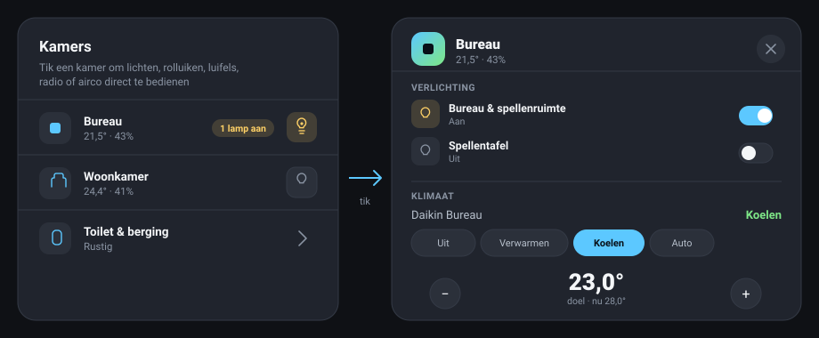

# HACS card: `juiced-dashboard-room-card`

Alongside the YAML dashboard config in `dashboard/**`, this repo also ships a small,
independent HACS-installable custom card: `custom:juiced-dashboard-room-card`. Tap a room,
get a popup with only what's actually controllable there — lights, covers, awnings, a media
player, climate — instead of navigating to a full dashboard page. A category with nothing
configured for a room is simply left out of its popup.



_Illustration reproduced from the card's own design tokens, not a pixel screenshot — see
[Preview harness](#preview-harness) below to see (and screenshot) the real thing running in
a browser._

This is additive, not a replacement: the existing static-YAML views and their migration
roadmap ([`pr-roadmap.md`](pr-roadmap.md), [`horizon-redesign-roadmap.md`](horizon-redesign-roadmap.md))
are untouched. This card is a new, separate capability that happens to live in the same
repository, built following the same architectural pattern (single-file TypeScript →
esbuild → a committed `dist/juiced-dashboard.js` bundle, `hacs.json`, HACS release
automation) as the sibling `ha-kia-connect-dashboard` and `garden-dashboard` projects, and
loosely inspired by — but sharing no code with — the independently developed
`ju1ced/home-dashboard` project.

## Install

### Prerequisites

- Home Assistant with [HACS](https://hacs.xyz) already installed.
- 5 minutes and a browser tab open on your Home Assistant instance.

### Step 1 — add the custom repository

HACS doesn't list this card in its default store yet, so it's added as a **custom
repository**:

1. Open **HACS** in the Home Assistant sidebar.
2. Click the **⋮** menu in the top-right corner → **Custom repositories**.
3. Fill in the dialog:
   - **Repository:** `https://github.com/ju1ced/juiced-dashboard`
   - **Category:** `Dashboard`
4. Click **Add**.

### Step 2 — install it

1. Search HACS for **Juiced Dashboard** (or find it under **Custom repositories** if it
   doesn't show up in search right away).
2. Open it and click **Download**.
3. Pick the latest version (the newest `v0.x.y` tag) and confirm.

### Step 3 — add the resource (usually automatic)

HACS normally registers the Lovelace resource for you. To check, or to add it by hand:

1. **Settings → Dashboards → ⋮ → Resources.**
2. Look for `/hacsfiles/juiced-dashboard/juiced-dashboard.js`. If it's not there, click
   **+ Add resource**, paste that URL, and set the type to **JavaScript Module**.

### Step 4 — refresh your browser

A **full** reload (not just navigating within Home Assistant) so the new module actually
loads: <kbd>Ctrl</kbd>+<kbd>Shift</kbd>+<kbd>R</kbd> (Windows/Linux) or
<kbd>Cmd</kbd>+<kbd>Shift</kbd>+<kbd>R</kbd> (macOS).

### Step 5 — add the card to a dashboard

1. Open the dashboard you want it on and click **Edit Dashboard** (pencil icon) →
   **+ Add Card**.
2. Search for **Juiced Dashboard Room Card** in the picker, or scroll to the bottom and
   choose **Manual** / **Show Code Editor** and paste a config directly (see
   [Configuration](#configuration) below — there's no visual editor yet, only the
   code editor).
3. Fill in at least one room with a `name` and one control category, save, and exit edit
   mode.

### Updating

HACS flags new releases automatically. **Download** the update from HACS, then do the same
full-reload as step 4 — cached JavaScript modules are the #1 cause of "the update didn't do
anything."

### Troubleshooting

| Symptom | Likely cause |
| --- | --- |
| Card picker doesn't show "Juiced Dashboard Room Card" | The resource isn't loaded — check step 3, then hard-refresh (step 4). |
| Dashboard shows a red "Custom element doesn't exist" error | Same as above — the JS module never loaded. |
| A room row shows "Rustig" when you expected a temperature | `temperature`/`humidity` weren't set for that room, or point at an entity that's `unavailable`/`unknown` — both render as the idle text on purpose (see [Configuration](#configuration)). |
| A light/cover/climate control does nothing | Double-check the `entity` id is spelled correctly and that entity actually exists — the card never fabricates a control for a missing entity. |

## Configuration

```yaml
type: custom:juiced-dashboard-room-card
title: Kamers
subtitle: Tik een kamer om lichten, rolluiken, luifels, radio of airco direct te bedienen
rooms:
  - name: Bureau
    icon: mdi:desk
    temperature: sensor.bureau_temperature # optional — shown on the row
    humidity: sensor.bureau_humidity # optional — shown on the row
    lights:
      - entity: light.bureau_spellenruimte
        name: Bureau & spellenruimte # optional — falls back to friendly_name
      - entity: light.bureau_spellentafel
    covers:
      - entity: cover.rolluik_bureau
    awnings:
      - entity: cover.luifel_bureau
    media_player: media_player.kantoor
    climate: climate.daikin_bureau
  - name: Toilet & berging
    icon: mdi:toilet
    lights:
      - entity: light.toilet
      - entity: light.berging
    # no covers/awnings/media_player/climate — those sections just don't
    # appear in this room's popup
```

### Room options

| Key            | Type                       | Required | Notes                                                                                   |
| -------------- | -------------------------- | -------- | ---------------------------------------------------------------------------------------- |
| `name`         | string                     | yes      | Row title and popup heading.                                                             |
| `icon`         | `mdi:…`                    | no       | Falls back to a generic room glyph.                                                      |
| `temperature`  | entity id                  | no       | Sensor shown on the row's stat line.                                                     |
| `humidity`     | entity id                  | no       | Sensor shown on the row's stat line.                                                     |
| `idle_text`    | string                     | no       | Row stat line when no temperature/humidity is configured (default `Rustig`).             |
| `lights`       | list of `{entity, name?}`  | no       | First entry also gets the row's quick-toggle button.                                     |
| `covers`       | list of `{entity, name?}`  | no       | Open/stop/close + position.                                                              |
| `awnings`      | list of `{entity, name?}`  | no       | Same controls as `covers`, its own popup section.                                        |
| `media_player` | entity id                  | no       | Now-playing + play/pause.                                                                |
| `climate`      | entity id                  | no       | hvac-mode buttons (from the entity's own `hvac_modes`) + a target-temperature stepper.   |

## Preview harness

`docs/renders/preview.html` loads the built bundle in a real browser against a small fake
`hass` object (fictional example data, matching the config above) — no Home Assistant
install required. Serve the repo root with any static file server and open the page, e.g.:

```sh
python -m http.server 8942
# then open http://localhost:8942/docs/renders/preview.html
```

This is how the card was manually verified end-to-end this session (list view, opening a
room's popup, all four sections rendering correctly) — and is the quickest way to get a
real pixel screenshot if you want one better than the SVG illustration above.

## Development

```sh
npm install
npm run verify   # typecheck + build + syntax check + unit tests
```

`src/cards/juiced-dashboard-room-card.ts` holds the card; `test/*.test.mjs` covers every
pure helper and service-call action, plus render-path smoke tests (via a minimal
hand-rolled fake shadow root — Node has no DOM) that assert the card never throws on
missing, unknown, or unavailable entities. Tests import from the **built**
`dist/juiced-dashboard.js` (an `npm run build` runs automatically before `npm test` via the
`pretest` script), not the TypeScript source, so there's no separate test-time TS loader to
maintain.

## Status

v0.1.0 is a working first release, ported from the (now superseded, archived)
[`ju1ced/juiced-room-card`](https://github.com/ju1ced/juiced-room-card) spike: YAML-only
configuration (no visual editor yet), not yet installed on a real Home Assistant instance
or exercised on MCP Test. See [`CHANGELOG.md`](../CHANGELOG.md).
